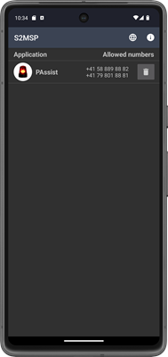

# Secure SMS Proxy (S2MSP)
[![Maven Central][maven-central-shield]][maven-central]
[![License][license-shield]][license]

![Project Maintenance][maintenance-shield]
[![Code Coverage][codecov-shield]][codecov]

[![Build Status][build-status-shield]][build-status]
[![Deploy Status][deploy-status-shield]][deploy-status]


<a href='https://apt.izzysoft.de/fdroid/index/apk/com.github.frimtec.android.securesmsproxy'></a>
---

<a href='https://lokalise.com'></a>

App language translations maintained with the great localization platform [Lokalise][lokalise].

---

As Google strongly restricts the use of SMS permissions for applications in the Play-Store, S2MSP provides an API for third party applications
to send and receive SMS to specific phone numbers via a secure SMS proxy.

S2MSP acts like a local firewall for SMS communication.

Each application that wants to send/receive SMS to a phone number can register itself on S2MSP.
S2MSP asks the user for permission, whether the requesting application is allowed to send/receive SMS from and to the requested phone numbers or not.


In the main view of S2MSP all applications with their allowed phone numbers are listed.



With the trash icon, the allowed permission for an application can be revoked again.

All SMS exchanged with third party applications are strongly encrypted.

S2SMP itself requires SMS permissions (SEND_SMS and RECEIVE_SMS) from the Android system and will request these permissions upon startup.
S2MSP does not need any other permissions. This ensures the integrity and security of S2MSP.

S2MSP supports the exchange of SMS for the following type of phone numbers:

| Type                     | Supported operation |
|--------------------------|---------------------|
| Numeric national         | SEND, RECEIVE       |
| Numeric international    | SEND, RECEIVE       |
| Numeric short codes      | SEND, RECEIVE       |
| Alphanumeric short codes | RECEIVE only        |

Numeric short codes are currently only supported for the following countries:
* Belgium (BE)
* Botswana (BW)
* Brazil (BR)
* Canada (CA)
* Chile (CL)
* Denmark (DK)
* Dominican Republic (DO)
* Finland (FI)
* France (FR)
* Germany (DE)
* Greece (GR)
* Hungary (HU)
* India (IN)
* Indonesia (ID)
* Ireland (IE)
* Italy (IT)
* Morocco (MA)
* Nepal (NP)
* Netherlands (NL)
* New Zealand (NZ)
* Nigeria (NG)
* Norway (NO)
* Panama (PA)
* Singapore (SG)
* Spain (ES)
* Sweden (SE)
* Switzerland (CH)
* Turkey (TR)
* USA (US)
* United Kingdom (GB)

## Installation
S2MSP cannot be offered on Google-Play as Google does only allow applications using SMS permissions in very rare cases
(see [Use of SMS or Call Log permission groups][use-sms-call-log-permission-groups]).

### Install from IzzyOnDroid
The easiest way to install S2MSP and keep it up-to-date is to install it from [IzzyOnDroid][izzy-on-droid].  
<a href='https://apt.izzysoft.de/fdroid/index/apk/com.github.frimtec.android.securesmsproxy'></a>

### Install pre build APK
You can download the APK file from the [GitHub release page][releases].
To install the APK you need to allow installation from unknown source.

### Self build
Build S2MSP on your own and then install the APK via ADB to your android phone.

## Integrating applications with S2MSP
S2MSP provides an easy API to integrate applications. The API supports the registration process, sending and receiving SMS,
as well as querying if specific phone numbers are already granted for the application.

### Adding the library to your project
The API is provided as an AAR (Android Archive) file and is available on [Maven Central][maven-central].
You can add the following dependency to your application project:
```
dependencies {
    implementation 'com.github.frimtec:secure-sms-proxy-api:3.3.0@aar'
    implementation 'com.vdurmont:semver4j:3.1.0'
}
```

### Define required permissions
In your applications Android-Manifest add the following queries:
```
<manifest package="your.application.package"
    xmlns:android="http://schemas.android.com/apk/res/android">
    
    ...

    <queries>
        <package android:name="com.github.frimtec.android.securesmsproxy" />
    </queries>
    
   ...
```

### Register your application with S2MSP to communicate via SMS for some defined phone numbers
In you activity do the following:

```
package your.application.package;
  ...
public class YourActivity extends AppCompatActivity {
  ...

  private static final int YOUR_REQUEST_CODE = ...;
  private SecureSmsProxyFacade s2msp;
 
  @Override
  public void onCreate(@Nullable Bundle savedInstanceState) {
    super.onCreate(savedInstanceState);
    s2msp = SecureSmsProxyFacade.instance(this.getContext());
    ...
  }

  anyMethod() {
    Set<String> phoneNumbers = ...;
    s2msp.register(this, YOUR_REQUEST_CODE, phoneNumbers, YourSmsListener.class);
  }
  
  @Override
  public void onActivityResult(int requestCode, int resultCode, Intent data) {
    super.onActivityResult(requestCode, resultCode, data);
    if (requestCode == YOUR_REQUEST_CODE) {
      RegistrationResult result = s2msp.getRegistrationResult(resultCode, data);
      result.getSecret().ifPresent(secret -> {/* store the secret permanently for later SMS communication */});
      if (result.getReturnCode().isSuccess()) {
        Toast.makeText(this, "Registration OK.", Toast.LENGTH_LONG).show();
        ...
      } else {
        Toast.makeText(this, "Registration FAILED: " + result.getReturnCode().name(), Toast.LENGTH_LONG).show();
        ...
      }
    }
    ...
  }
  
  ...
```

### Receiving SMS in your registered SMS listener
The SMS listener registered in the previous step should look like this:
```
package your.application.package;

public class YourSmsListener extends BroadcastReceiver {

  @Override
  public void onReceive(Context context, Intent intent) {
    if ("your.application.package.SMS_RECEIVED".equals(intent.getAction())) {
      List<Sms> receivedSms = getSmsFromIntent(context, intent);
      for (Sms sms : receivedSms) {
         ...
      }
    }
  }

  private static List<Sms> getSmsFromIntent(Context context, Intent intent) {
    SecureSmsProxyFacade s2msp = SecureSmsProxyFacade.instance(context);
    String secret = ...; // secret from your registration
    return s2msp.extractReceivedSms(intent, secret);
  }
  
  ...
```

### Sending an SMS
A SMS can be send with the following code:
```
  void sendSms(Context context, String phoneNumber, String smsText) {
    SecureSmsProxyFacade s2msp = SecureSmsProxyFacade.instance(context);
    String secret = ...; // secret from your registration
    s2msp.sendSms(new Sms(phoneNumber, smsText), secret);
  }

```

### Check if you application is allowed to send/receive SMS with specific phone numbers
You can check if you application is allowed to communicate to a given set of phone numbers:
```
    SecureSmsProxyFacade s2msp = SecureSmsProxyFacade.instance(context);
    Set<String> phoneNumbers = ...; // phone numbers to check
    boolean allowed = s2msp.isAllowed(phoneNumbers);
```

## Supported languages
Currently the following languages are supported in S2MSP:
* English
* German
* French
* Italian

Translation support for any additional language is warmly welcome - just get in contact with me.
S2MSP is using [Lokalise][lokalise] to maintain language translations.

## Open-Source and free
S2MSP is Open-Source and available under Apache-2.0 licence.
If you find S2MSP useful and use it on a regular basis for your on-call duties, a voluntary donation is warmly welcome.

## Disclaimer
The use of S2MSP is at your own risk. The author assumes no liability for malfunctions of the application.
Any warranty claims are excluded.

## Development
S2MSP is developed with [Android-Studio][android-studio] with Java 17.
The current Android target SDK is 35 (Android 15-VanillaIceCream) and the minimal SDK is 24 (Android 7.0-Nougat).

## Used libraries
* [libphonenumber][libphonenumber]
* [semver4j][semver4j]

## Feedback
Feedback, bug reports or feature requests are very welcome.
You can send an email to [frimtec@gmx.ch](mailto:frimtec@gmx.ch) or [open an issue on GitHub][issues].

## Credits
* [Lokalise][lokalise]: For supporting Open-Source projects.
* [bakito][github-bakito]: For implementing dual SIM support.
* [IzzySoft][github-izzysoft]: For offering S2MSP on IzzyOnDroid F-Droid repository.


[maven-central-shield]: https://maven-badges.herokuapp.com/maven-central/com.github.frimtec/secure-sms-proxy-api/badge.svg
[maven-central]: https://maven-badges.herokuapp.com/maven-central/com.github.frimtec/secure-sms-proxy-api
[maintenance-shield]: https://img.shields.io/maintenance/yes/2024.svg
[license-shield]: https://img.shields.io/github/license/frimtec/secure-sms-proxy.svg
[license]: https://opensource.org/licenses/Apache-2.0
[codecov-shield]: https://codecov.io/gh/frimtec/secure-sms-proxy/branch/master/graph/badge.svg?token=3GBTDIFRC7
[codecov]: https://codecov.io/gh/frimtec/secure-sms-proxy
[build-status-shield]: https://github.com/frimtec/secure-sms-proxy/workflows/Build/badge.svg
[build-status]: https://github.com/frimtec/secure-sms-proxy/actions?query=workflow%3ABuild
[deploy-status-shield]: https://github.com/frimtec/secure-sms-proxy/workflows/Deploy%20release/badge.svg
[deploy-status]: https://github.com/frimtec/secure-sms-proxy/actions?query=workflow%3A%22Deploy+release%22
[issues]: https://github.com/frimtec/secure-sms-proxy/issues
[releases]: https://github.com/frimtec/secure-sms-proxy/releases
[github-bakito]: https://github.com/bakito
[github-izzysoft]: https://github.com/IzzySoft
[android-studio]: https://developer.android.com/studio
[izzy-on-droid]: https://apt.izzysoft.de/fdroid/index/apk/com.github.frimtec.android.securesmsproxy
[maven-central]: https://maven-badges.herokuapp.com/maven-central/com.github.frimtec/secure-sms-proxy-api
[use-sms-call-log-permission-groups]: https://support.google.com/googleplay/android-developer/answer/9047303?hl=en
[lokalise]: https://lokalise.com/
[libphonenumber]: https://github.com/google/libphonenumber
[semver4j]: https://github.com/vdurmont/semver4j
